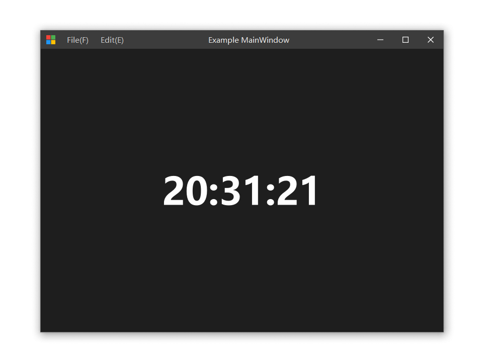
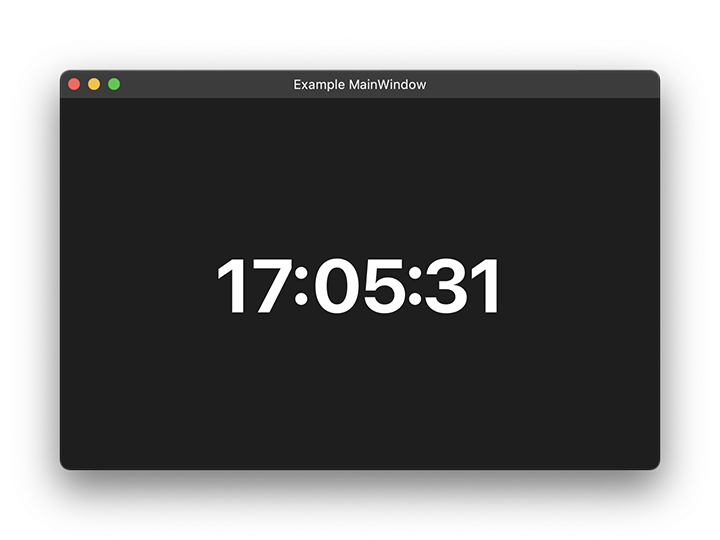

# QWindowKit

Cross-platform window customization framework for Qt Widgets and Qt Quick.

This project inherited most of [wangwenx190 FramelessHelper](https://github.com/wangwenx190/framelesshelper)
implementation, with a complete refactoring and upgrading of the architecture.

Feature requests are welcome.

## Join with Us :triangular_flag_on_post:

You can join our [Discord channel](https://discord.gg/grrM4Tmesy). You can share your findings, thoughts and ideas on improving / implementing FramelessHelper functionalities on more platforms and apps!

## Supported Platforms

+ Microsoft Windows
+ Apple macOS (11+)
+ GNU/Linux

## Features

+ Full support of Windows 11 Snap Layout
+ Better workaround to handle Windows 10 top border issue
+ Support Mac system buttons geometry customization
+ Simpler APIs, more detailed documentations and comments

## Gallery

### Windows 11 (With Snap Layout)


### Windows 10 (And 7, Vista)



### macOS & Linux

|              macOS              |       Linux (Ubuntu 20.04)        |
|:-------------------------------:|:---------------------------------:|
|  |  |

## Requirements

| Component | Requirement |          Details          |
|:---------:|:-----------:|:-------------------------:|
|    Qt     |   \>=5.12   | Core, Gui, Widgets, Quick |
| Compiler  |  \>=C++17   |   MSVC 2019, GCC, Clang   |
|   CMake   |   \>=3.17   |   >=3.20 is recommended   |

### Tested Compilers

+ Windows
    + MSVC: 2019, 2022
    + MinGW (GCC): 13.2.0
+ macOS
    + Clang 14.0.3
+ Ubuntu
    + GCC: 9.4.0

## Dependencies

+ Qt 5.12 or higher
+ [qmsetup](https://github.com/stdware/qmsetup)

## Integrate

### Build & Install

```sh
cmake -B build \
  -Dqmsetup_DIR=<dir> \ # Optional
  -DCMAKE_INSTALL_PREFIX=/path/install \
  -G "Ninja Multi-Config"

cmake --build build --target install --config Debug
cmake --build build --target install --config Release
```

You can also include this directory as a subproject if you choose CMake as your build system.

For other build systems, you need to install with CMake first and include the corresponding configuration files in your
project.

### Import

#### CMake Project

```sh
cmake -B build -DQWindowKit_DIR=/path/install/cmake/QWindowKit
```

```cmake
find_package(QWindowKit REQUIRED)
target_link_libraries(widgets_app PUBLIC QWindowKit::Widgets)
target_link_libraries(quick_app PUBLIC QWindowKit::Quick)
```

#### QMake Project

```cmake
# WidgetsApp.pro
include("/path/install/share/QWindowKit/qmake/QWKWidgets.pri")

# QuickApp.pro
include("/path/install/share/QWindowKit/qmake/QWKQuick.pri")
```

#### Visual Studio Project

TODO

## Quick Start

### Qt Widgets Application

#### Setup Window Agent

First, setup `WidgetWindowAgent` for your top `QWidget` instance. (Each window needs its own agent.)

```c++
#include <QWKWidgets/widgetwindowagent.h>

MyWidget::MyWidget(QWidget *parent) {
    // ...
    auto agent = new QWK::WidgetWindowAgent(this);
    agent->setup(this);
    // ...
}
```

If you don't want to derive a new widget class or change the constructor, you can initialize the agent after the window
constructs.

```c++
auto w = new MyWidget();
auto agent = new QWK::WidgetWindowAgent(w);
agent->setup(w);
```

#### Construct Title bar

Then, construct your title bar widget, without which the window lacks the basic interaction feature, and it's better to
put it into the window's layout.

You can use the [`WindowBar`](examples/shared/widgetframe/windowbar.h) provided by `WidgetFrame` in the examples as the
container of your title bar components.

Let `WidgetWindowAgent` know which widget the title bar is.

```c++
agent->setTitleBar(myTitleBar);
```

Next, set system button hints to let `WidgetWindowAgent` know the role of the child widgets, which is important for the
Snap Layout to work.

```c++
agent->setSystemButton(QWK::WindowAgentBase::WindowIcon, myTitleBar->iconButton());
agent->setSystemButton(QWK::WindowAgentBase::Minimize, myTitleBar->minButton());
agent->setSystemButton(QWK::WindowAgentBase::Maximize, myTitleBar->maxButton());
agent->setSystemButton(QWK::WindowAgentBase::Close, myTitleBar->closeButton());
```

Doing this does not mean that these buttons' click events are automatically associated with window actions, you still
need to manually connect the signals and slots to emulate the native window behaviors.

On macOS, this step can be skipped because it is better to use the buttons provided by the system.

Last but not least, set hit-test visible hint to let `WidgetWindowAgent` know other widgets that desire to receive mouse
events.

```c++
agent->setHitTestVisible(myTitleBar->menuBar(), true);
```

The rest region within the title bar will be regarded as the draggable area for the user to move the window.

<!-- #### Window Attributes (Experimental)

On Windows 11, you can use this API to enable system effects.

```c++
agent->setWindowAttribute("mica", true);
```

Available keys: `mica`, `mica-alt`, `acrylic`, `dark-mode`. -->

### Qt Quick Application

#### Initialization

Make sure you have registered `QWindowKit` into QtQuick:

```cpp
#include <QWKQuick/qwkquickglobal.h>

int main(int argc, char *argv[])
{
    // ...
    QQmlApplicationEngine engine;
    // ...
    QWK::registerTypes(&engine);
    // ...
}
```

#### Setup Window Components

Then you can use `QWindowKit` data types and classes by importing it's URI:

```qml
import QtQuick 2.15
import QtQuick.Window 2.15
import QWindowKit 1.0

Window {
    id: window
    visible: false // We hide it first, so we can move the window to our desired position silently.
    Component.onCompleted: {
        windowAgent.setup(window)
        window.visible = true
    }
    WindowAgent {
      // ...
    }
}
```

You can omit the version number or use "auto" instead of "1.0" for the module URI if you are using Qt6.

### Learn More

See [examples](examples) for more demo use cases. The examples have no High DPI support.

+ [FramelessHelper Related](docs/framelesshelper-related.md)

## TODO

+ Fix 5.15 window abnormal behavior
+ Support Mac style change notification
+ Support Mac system buttons customization for Quick
+ More documentations
+ When do we support Linux native features?

## Special Thanks

+ [Arabaku](https://github.com/Arabaku)
+ [Maplespe](https://github.com/Maplespe)
+ [zhiyiYo](https://github.com/zhiyiYo)

## License

QWindowKit is licensed under the Apache 2.0 License.